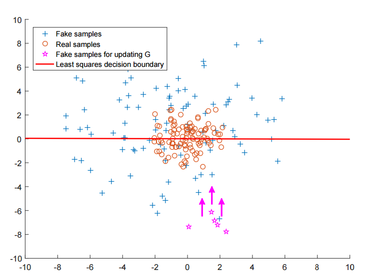
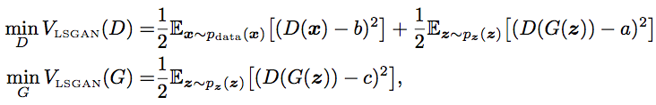

# LSGAN.pytorch
Repository for Pytorch Implementation of Least Squares Generative Adversarial Networks

## Least Squares Generative Adversarial Networks

Regular GANs hypothesize the discriminator as a classifier with the sigmoid cross entropy loss function.

This loss function, however, may lead to the [vanishing gradient problem](https://en.wikipedia.org/wiki/Vanishing_gradient_problem) during the learning process.

LSGANs(Least Squares GAN) adopt the least squares loss function for the discriminator.

The paper shows that the objective function for LSGAN yields minimizing the [Pearson chi-square divergence](http://citeseerx.ist.psu.edu/viewdoc/download?doi=10.1.1.518.7353&rep=rep1&type=pdf).

## Basic Setups

## How to run
